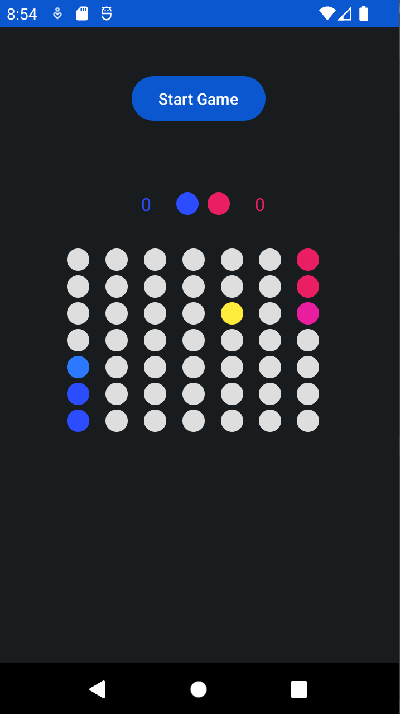

# Robots! - Android Game

**Robots!** is a turn-based auto game where two robots compete to find a hidden prize on a game board. Each robot moves in search of the prize, leaving a trail that the other robot cannot cross. This app is a fun implementation of the classic game Robots! for Android devices.



## Features

- **Multi-Round Game:** The game consists of multiple rounds where robots try to reach the prize.

- **Automatic Movements:** Robots move automatically in turns, with a half-second pause between each move.

- **Movement Trails:** Each robot leaves a trail that blocks the other's movement.

- **Point for the Winner:** The robot that reaches the prize first earns a point.

- **User-Friendly Interface:** Attractive and user-friendly interface for an immersive gaming experience.

## How to Play

1. **Start the Game:** Tap the "Start Game" button to begin a new round.

2. **Follow the Moves:** Observe the automatic movements of the robots and their trails on the board.

3. **Scoring:** The robot that reaches the prize first earns a point. The score is displayed on the screen.


## How to Compile and Run

1. **Environment Setup:** Ensure you have the Android development environment set up on your machine.

2. **Clone the Repository:** Clone this repository to your local machine.

   ```shell
   git clone git@github.com:rafael-sc/Robots.gitt
